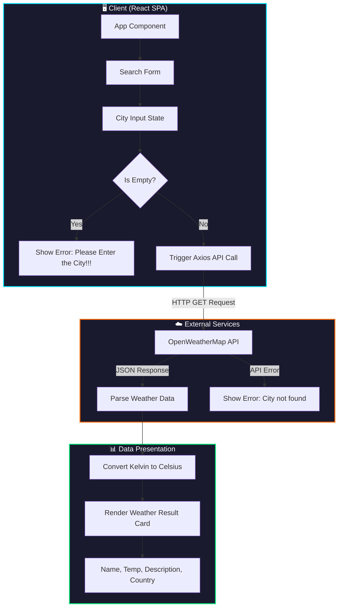

<p align="center">
  
</p>

<p align="center">
  <a href="#-about-the-project"></a>
  <a href="#-tech-stack"></a>
  <a href="#-quick-start"></a>
  <a href="#-developer"></a>
</p>

<p align="center">
  
  
  
  
</p>

---

## 📋 Table of Contents
<details open>
<summary><b>Click to expand/collapse</b></summary>

- [🌤️ About the Project](#️-about-the-project)
- [✨ Key Deliverables & Features](#-key-deliverables--features)
- [🏗️ System Flow & Architecture](#️-system-flow--architecture)
- [⚡ Tech Stack](#-tech-stack)
- [📁 Folder Structure](#-folder-structure)
- [🚀 Quick Start](#-quick-start)
- [👥 Developer](#-developer)

</details>

---

## 🌤️ About the Project
<table>
<tr>
<td width="60%">

**Weather App** is a sleek, real-time weather broadcasting application built using React.js. 

By integrating directly with the **OpenWeatherMap API**, it enables users to search for any city globally and receive instant, up-to-date weather reports. 

Rooted in a **responsive glassmorphic container design**, it features custom-built zoom animations, dynamic Celsius conversion, and robust input validations—delivering a premium and fluid user experience across both desktop and mobile devices.

</td>
<td width="40%">

```text
  ╔══════════════════════════╗
  ║    🌤️ WEATHER APP        ║
  ║                          ║
  ║  ┌────────────────────┐  ║
  ║  │   Search City...   │  ║
  ║  └────────────────────┘  ║
  ║            │             ║
  ║            ▼             ║
  ║  ┌────────────────────┐  ║
  ║  │     London, GB     │  ║
  ║  │      15.4 °C       │  ║
  ║  │  scattered clouds  │  ║
  ║  └────────────────────┘  ║
  ╚══════════════════════════╝
```

</td>
</tr>
</table>

---

## ✨ Key Deliverables & Features

<table>
<tr>
<td>

✔️ **Real-Time Data Integration:** Connects directly with the OpenWeatherMap endpoint for live statistics.<br/>
✔️ **Celsius Converter:** Automatically converts standard Kelvin readings from the API to Celsius `(K - 273.15)` dynamically on the client side.<br/>
✔️ **Glassmorphic UI Design:** Card interfaces styled with back-drop filter blurs, white outlines, and deep drop-shadows for a premium 3D feel.<br/>
✔️ **Responsive Keyframe Animations:** Features looping `@keyframes` desktop and mobile background zoom animations that feel organic and alive.<br/>
✔️ **Robust Validation Checks:** Instantly checks for empty inputs ("Please Enter the City!!!") and catches API status codes for invalid queries ("City not found").<br/>
✔️ **Responsive Layout Grid:** Tailored layouts using CSS media queries, keeping input elements and buttons legible and beautiful on all viewport widths.

</td>
</tr>
</table>

---

## 🏗️ System Flow & Architecture

The application operates as a single-page React client, executing asynchronous API fetches and resolving response layers dynamically.



---

## ⚡ Tech Stack

<div align="center">

| Layer | Technology | Purpose |
|:---:|:---:|:---:|
|  | React.js | Fast UI component rendering & state management |
|  | Axios | High-performance promise-based API fetching |
|  | OpenWeatherMap | World-wide real-time weather database |
|  | Vanilla CSS3 | Custom viewport animations, Flexbox, & Media Queries |

</div>

---

## 📁 Folder Structure
```bash
weather_application/
│
├── public/
│   ├── assets/                 # Brand assets
│   ├── favicon.ico             # App icon
│   ├── index.html              # Main HTML mount template
│   ├── manifest.json           # PWA metadata configuration
│   ├── robots.txt              # Search engine crawler policies
│   └── cloudy.png              # Search page illustration
│
├── src/
│   ├── App.css                 # Global styling, Glassmorphism, animations, media queries
│   ├── App.js                  # Core component: form validation, Axios API fetching, result rendering
│   ├── index.css               # Base reset rules and root styles
│   ├── index.js                # React DOM render entrypoint
│   ├── reportWebVitals.js      # App performance tracking logic
│   ├── setupTests.js           # Test suite configurations
│   ├── sea.jpg                 # Desktop dynamic zoom background image
│   └── weather_img.jpg         # Weather graphics resource
│
├── package.json                # Project dependencies and script runner configurations
└── README.md                   # Visual project overview & manual
```

---

## 🚀 Quick Start (Local Setup)

```bash
# 1. Clone the repository
git clone https://github.com/poojamurugan23/Weather-App.git
cd "Weather App"

# 2. Install dependencies
npm install

# 3. Start the application
npm start
```

Your browser will automatically launch the project at `http://localhost:3000`.

---

<div align="center">

## 👥 Developer

<br/>

<table style="border-collapse: collapse; border: none; background: transparent; margin: 0 auto;">
  <tr>
    <td align="center">
      
      <br/><br/>
      
      <br/>
      <br/>
      <sub><b>Frontend Developer & UI/UX Designer <br>Crafting Interactive and Responsive Web Experiences</b></sub>
      <br/><br/>
      <a href="https://www.linkedin.com/in/poojamurugan23/" target="_blank">
        
      </a>
    </td>
  </tr>
</table>

<br/>


</div>